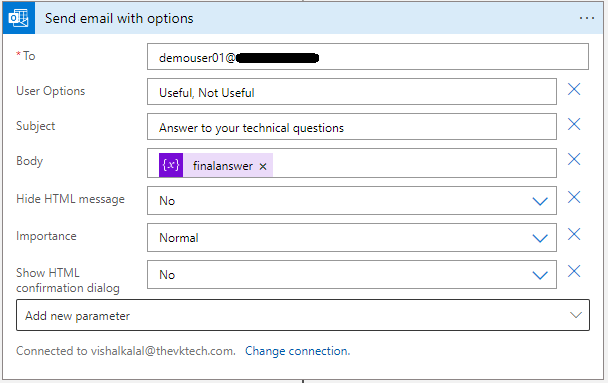

# AUTOMATE YOUR MAILBOX RESPONSES

## Objective

In this lab you will lean how to use OpenAI to help answer common IT questions sent to help desk mailboxes

 

## Summary

You will need to deploy 2 logic apps:

Logic App 1: reads incoming email from an outlook mailbox and calls Logic App2

Logic App 2: Calls Azure OpenAI for answers to the user support question and emails back a response. 

### Note: 

We will deploy the 2nd logic app first because we need its URL when provisioning the first logic app.

## Step 1. Signin to Azure Portal

Go to https://portal.azure.com and enter your credentials

## Step 2. Deploy Logic App 2 (email-techsupport-integration)

### OpenAI Prompt Overview
This logic app uses the following prompt to answer questions sent to a technical support mail box:

_________________________________________________________________________
Extract the person name  and technical problems from the text below, look for possible solutions and write and email that includes posible solutions for software problems include links to websites, if no solutions are indicate we will get back to them. If this is a hardware problem give them tips for troubleshooting and indicate we will create a support ticket and schedule a repair within 48 hours.  Write links to websites in html code.

______________________________________________________________________________

In this step you are going to perform the following actions to deploy and configure the logic app:

- Deploy the logic app that sends the user question to OpenAI
- Copy the URL for this Logic App for use in the second logic app
- Enter OpenAI authentication credentials
- Configure your connection to Outlook

After the deployment you should see two new items in your resource group

  

  Click on the logic app and click on the edit button

   

Expand the first box "When an HTTP is received" and copy the URL to your text editor

Scroll down to the HTTP box and enter your OpenAI api key and the OpenAI endpoint with the following format:

**"https://<YOUR_AZURE_OPENAI_RESOURCENAME>.openai.azure.com/openai/deployments/<DEPLOYMENT_NAME>/completions?api-version=2022-12-01"**

You can find the <DEPLOYMENT_NAME> in the Azure OpenAI Studio Deployments blade as shown below:

Scroll down to the action box with the outlook logo and expand it to enter new authorizaion credentials for your mailbox:

Scroll down to the condition option and expand it, then expand the true option. There select the valid connection to send the final notification in this logic app.

Scroll up to the "Send email with options" and change the email in the "To" section to the email address that should receive the automated email:

Save the logic app

### Step 3. Deploy Logic App 1 (read-mailbox-techsupport)

This logic app scans a mail box every X minutes for new emails with the subject: **"Tech support automation"**.

Note: When you click the 'Deploy to Azure' button below, you will need to provide the URL to your first logic app in the 'Email_integration_url' parameter field.

In this step you are going to perform the following actions to deploy and configure the logic app:

- Deploy the logic app that sends the user question to OpenAI
- Configure your connection to Outlook

After the deployment you should see the new logic app your resource group, open the logic app and click the edit button

  

Select the top box titled connection and select the appropiate connection to office 365 outlook

### Step 4. Test

Send an email to the mailbox configured in your second logic app
> **Don't forget the email subject**

**"Tech support automation"**

You can use this test:
_______________________________________________________________

Hello,

I can't login into my account, I need to reset my password, also my keyboard is not working

Thank you
_______________________________________________________________
